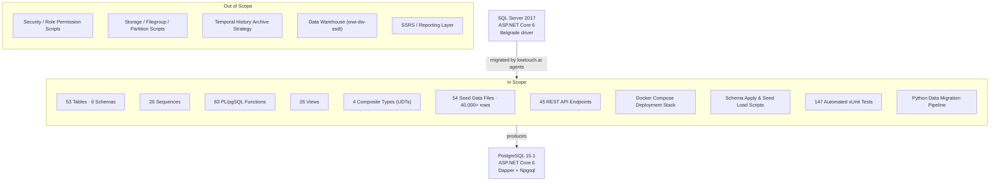

# lowtouch.ai
### *AI Agents That Run in Your Infrastructure. Deployed in Weeks, Not Months.*

---

# Product Requirements Document
## WideWorldImporters: MSSQL → PostgreSQL Migration

| Field | Value |
|---|---|
| **Project** | WideWorldImporters Database & Application Migration |
| **Version** | 1.0 |
| **Date** | May 2026 |
| **Status** |  |
| **Client** | Internal / lowtouch.ai Reference Implementation |

---

## Table of Contents

1. [Executive Summary](#1-executive-summary)
2. [Application Overview](#2-application-overview)
3. [Business Objectives](#3-business-objectives)
4. [Scope](#4-scope)
5. [Stakeholders](#5-stakeholders)
6. [Functional Requirements](#6-functional-requirements)
7. [Data Migration Requirements](#7-data-migration-requirements)
8. [Non-Functional Requirements](#8-non-functional-requirements)
9. [Success Criteria](#9-success-criteria)
10. [Constraints and Assumptions](#10-constraints-and-assumptions)
11. [Risks and Mitigations](#11-risks-and-mitigations)
12. [Deliverables](#12-deliverables)

---

## 1. Executive Summary

The WideWorldImporters migration project is a complete, end-to-end relocation of Microsoft's canonical OLTP sample database — originally designed for SQL Server 2017 — onto a fully open-source PostgreSQL 15.1 stack. The project encompasses the database engine, all business logic encoded as stored procedures, the REST API application layer, seed data, and a suite of automated tests. Every component runs locally or on customer infrastructure inside Docker containers, with no dependency on any cloud vendor or third-party service.

This engagement was delivered using lowtouch.ai's agentic AI workflow. The entire migration — 53 tables, 83 database functions, 45 API endpoints, and 147 automated tests — was driven by AI agents executing against well-defined conversion rules. Human effort was focused on reviewing outputs and making architectural decisions, not on line-by-line translation work. The result is a fully functional, production-ready replacement system produced in a fraction of the time traditional manual migration would require.

The completed system starts with a single `docker compose up` command. All 147 automated tests pass against the live stack. The migration demonstrates that AI-assisted database modernisation is viable at enterprise scale, producing auditable, maintainable artefacts while preserving complete functional fidelity with the source system.

---

## 2. Application Overview

WideWorldImporters is an OLTP (Online Transaction Processing) sample application modelling a wholesale novelty goods importer. It covers sales, purchasing, warehouse, and supplier management across a full business transaction lifecycle.

### Architecture

The application follows ASP.NET Core 6 MVC (Model-View-Controller) pattern with two data controllers:

| Controller | Role | Operations |
|---|---|---|
| `TableController` | Paginated data-grid reads | Reads from PostgreSQL views — SalesOrders, Invoices, CustomerTransactions, Suppliers, StockItems, etc. |
| `ODataController` | Structured CRUD operations | GET / PUT / POST / DELETE on all 24 business entities via PL/pgSQL functions |

### Source Database

| Object Type | Count | Description |
|---|---|---|
| Tables | 53 | Across 6 schemas: Application, Sales, Purchasing, Warehouse, WebApi, Website |
| Stored Procedures | 83 | All business data operations — insert, update, delete, search, login |
| Views | 26 | Read-optimised projections consumed by the application |
| Sequences | 26 | Auto-increment ID generators |
| User Defined Types | 4 | Composite types used by Website schema functions |

### Migration Scope Clarification

> **Important:** This migration changes ONLY the database connectivity layer. The application's business logic, MVC structure, controller actions, Razor views, and all user-facing functionality are preserved exactly as-is. Users will observe no difference in behaviour after migration.

### Environment Comparison

| Component | Source (MSSQL) | Target (PostgreSQL) |
|---|---|---|
| Database engine | SQL Server 2017 | PostgreSQL 15.1 |
| Database driver | Belgrade + Microsoft.Data.SqlClient | Npgsql 8.0.3 + Dapper 2.1.28 |
| Application framework | ASP.NET Core 6 | ASP.NET Core 6 (unchanged) |
| Container runtime | Docker (SQL Server image) | Docker Compose (PostgreSQL + app) |
| Geographic data | `sys.geography` type | PostGIS extension |
| JSON operations | `OPENJSON` / T-SQL | `jsonb_to_record` / PL/pgSQL |

---

## 3. Business Objectives

| # | Objective | Business Driver |
|---|---|---|
| BO-1 | Eliminate SQL Server licensing costs | Microsoft SQL Server licences are a significant recurring expense. PostgreSQL is open-source with no per-core or per-server fees. |
| BO-2 | Remove vendor lock-in | SQL Server ties the application to Windows or Azure. PostgreSQL runs on any Linux host, any container platform, and any cloud provider. |
| BO-3 | Improve cloud-readiness and portability | A Docker Compose-based stack can be promoted to Kubernetes, AWS ECS, Azure Container Apps, or any OCI-compatible platform without rework. |
| BO-4 | Modernise the application stack | Replace the database connectivity layer in the ASP.NET Core 6 application from Belgrade/SqlClient (MSSQL-only) to Dapper + Npgsql (PostgreSQL-native). No changes to application business logic, MVC structure, or user-facing functionality. |
| BO-5 | Validate the lowtouch.ai agentic migration pattern | Demonstrate that AI agents can perform complex multi-schema database migrations accurately and at speed, creating a repeatable playbook for future client engagements. |

---

## 4. Scope

### System Boundary

### In Scope

- Database connectivity layer replacement (Belgrade/SqlClient → Npgsql/Dapper)
- No changes to application business logic, MVC structure, controller actions, or user-facing functionality
- Full DDL conversion for all 6 OLTP schemas: **Application, Sales, Purchasing, Warehouse, Website, Integration**
- All 26 sequences, 4 composite types (UDTs), and 26 views
- All 83 stored procedures converted to native PL/pgSQL functions
- All 45 REST API endpoints ported from Belgrade/MSSQL to Dapper/Npgsql
- 54 seed data files producing 40,000+ rows of reference and transactional data
- Idempotent 9-phase schema deployment script
- Python pipeline for data export and live migration
- 147 automated xUnit tests covering controllers and all major API endpoints

### Out of Scope

| Item | Reason |
|---|---|
| Security / role permission scripts | Role model to be defined per target environment deployment policy |
| Storage / filegroup / partition scripts | Filegroup constructs have no PostgreSQL equivalent; partitioning strategy deferred to operations team |
| Temporal history archive strategy | Archive table retention policy is a business decision; temporal columns converted to plain timestamps |
| OLAP data warehouse (`wwi-dw-ssdt`) | Separate project; analytical workload not in this engagement |
| SSRS / reporting layer | No direct PostgreSQL equivalent; BI tool selection deferred |

---

## 5. Stakeholders

| Role | Interest / Concern |
|---|---|
| **Database Administrator** | Schema correctness, data integrity, index parity, sequence continuity |
| **Application Developer** | API contract fidelity, connection string changes, ORM compatibility |
| **Security / Compliance** | Secret management, network isolation |
| **Infrastructure / DevOps** | Container orchestration, deployment automation, environment repeatability |
| **Finance / Procurement** | SQL Server licence elimination, total cost of ownership reduction |
| **Engineering Manager** | Delivery timeline, test coverage, maintainability of migrated codebase |
| **lowtouch.ai (delivery team)** | Validating the agentic migration playbook as a repeatable client offering |

---

## 6. Functional Requirements

### FR-1: Full Schema Parity

**FR-1.1** All 53 source tables shall be represented in the target PostgreSQL database with equivalent column names, data types, nullability constraints, primary keys, and unique constraints.

**FR-1.2** All 26 sequences shall be created as PostgreSQL `SEQUENCE` objects and referenced by their consuming tables via `DEFAULT nextval(...)`.

**FR-1.3** All 4 MSSQL user-defined table types (UDTs) shall be converted to PostgreSQL composite `CREATE TYPE` declarations.

**FR-1.4** All 26 views (23 WebApi + 3 Website) shall be recreated as PostgreSQL `CREATE OR REPLACE VIEW` statements with equivalent projection and join logic.

**FR-1.5** Temporal table columns (`GENERATED ALWAYS AS ROW START/END`) shall be converted to plain `TIMESTAMP(6) NOT NULL DEFAULT CURRENT_TIMESTAMP` columns; paired `_Archive` tables shall be retained as regular tables.

### FR-2: Business Logic Parity (Functions)

**FR-2.1** All 83 stored procedures shall be converted to PL/pgSQL functions accepting equivalent parameters and returning equivalent result sets or scalar values.

**FR-2.2** Functions shall handle JSON input payloads using PostgreSQL `JSONB` semantics, including correct casting from `text` where required.

**FR-2.3** MSSQL-specific constructs (`GO`, `SET IDENTITY_INSERT`, `N'string'` literals, `BEGIN TRAN`/`COMMIT TRAN`) shall be removed or replaced with PostgreSQL equivalents.

### FR-3: Data Integrity

**FR-3.1** All foreign key relationships present in the source schema shall be recreated in the target schema with equivalent referential actions (`ON DELETE`, `ON UPDATE`).

**FR-3.2** Seed data shall be loaded in foreign-key dependency order to avoid constraint violations during initial population.

**FR-3.3** Sequence current values shall be synchronised to the maximum existing ID in each table after seed data load, preventing primary key conflicts on first insert.

### FR-4: API Compatibility

**FR-4.1** All 45 REST API endpoints shall be available at equivalent URL paths with equivalent request/response schemas.

**FR-4.2** GET list endpoints shall support OData-style filtering, ordering, and pagination where the source system supported it.

**FR-4.3** PUT/POST endpoints shall accept the same JSON payloads as the source system, routed through the equivalent PL/pgSQL functions.

**FR-4.4** The application shall connect to PostgreSQL using Dapper + Npgsql; all Belgrade/MSSQL driver references shall be removed.

### FR-5: Application Connectivity

**FR-5.1** The database driver shall be replaced from Microsoft's SqlClient/Belgrade to Npgsql 8.0.3 with Dapper 2.1.28.

**FR-5.2** The application's MVC structure, controller actions, view templates, and all user-facing functionality shall remain identical to the source system.

**FR-5.3** Only the connection string, driver registration in Startup.cs, and SQL parameter syntax shall change.

### FR-6: Automated Deployment

**FR-6.1** A single `docker compose up` command shall start the full stack: PostgreSQL 15.1 and the ASP.NET Core 6 application.

**FR-6.2** `scripts/apply-schema.sh` shall apply the full database schema in 9 ordered phases: extensions → sequences → tables → types → views → functions → fixes → seed → sync sequences. The script shall be idempotent (safe to re-run).

**FR-6.3** `scripts/load-seed.sh` shall load all 54 seed files in ascending numeric order.

**FR-6.4** The Python pipeline (`convert-pds.py`, `migrate_data.py`, `export_to_sql.py`) shall provide tooling for both live data migration from MSSQL and air-gapped export to portable `.sql` INSERT files.

### FR-7: Automated Testing

**FR-7.1** An automated test suite shall verify all critical application paths post-migration using xUnit + WebApplicationFactory.

**FR-7.2** Unit tests shall cover controller dispatch logic and JSON response shapes (TableController: 8 tests, ODataController: 11 tests).

**FR-7.3** Integration tests shall execute full HTTP request → PostgreSQL round-trips against a live Docker PostgreSQL instance (SalesOrders: 8, Invoices: 8, CustomerTransactions: 9, plus purchasing and warehouse modules).

**FR-7.4** All tests shall pass against the target PostgreSQL environment before migration is considered complete. Total: 147 tests.

**FR-7.5** Integration tests shall validate: response HTTP status codes, JSON response shape and required fields, pagination behaviour, search/filter operations, and numeric field precision.

---

## 7. Data Migration Requirements

### DMR-1: Completeness
All rows from all 53 source tables shall be migrated with no data loss. Row counts shall be verified post-migration.

### DMR-2: Referential Integrity
Data shall be migrated in foreign key dependency order. Referential integrity constraints shall be verified after migration completes.

### DMR-3: Large Dataset Handling
The migration pipeline shall support tables of arbitrary size without memory exhaustion or connection timeouts:
- All table transfers use fixed-size batches (2,000 rows per batch for live migration, 5,000 rows per batch for SQL file export)
- Each batch is committed independently — a failure mid-table can be resumed without re-processing completed batches
- `ON CONFLICT DO NOTHING` semantics make every batch idempotent

### DMR-4: Minimal Downtime
The live migration path (`migrate_data.py`) connects to both source and target databases simultaneously. Foreign key constraint enforcement is suspended during bulk load and re-enabled after completion, minimising migration window duration.

### DMR-5: Sequence Synchronisation
After data load, all 26 PostgreSQL sequences shall be reset to `MAX(id) + 1` of their respective tables to prevent duplicate key errors on subsequent application inserts.

### DMR-6: Portability
An offline migration path (`export_to_sql.py`) shall produce portable `.sql` INSERT files loadable on any PostgreSQL instance without requiring a live MSSQL connection, supporting air-gapped deployment scenarios.

---

## 8. Non-Functional Requirements

| ID | Category | Requirement |
|---|---|---|
| NFR-1 | **Performance** | Schema apply script shall complete within 5 minutes on commodity hardware. Seed load (40,000+ rows) shall complete within 10 minutes. |
| NFR-2 | **Security** | No database credentials or API secrets shall be committed to the repository. All secrets shall be supplied via environment variables or Docker Compose `.env` files. |
| NFR-3 | **Portability** | The full stack shall run on any host with Docker Engine 24+ and Docker Compose v2, on Linux, macOS, or Windows (WSL2). No cloud provider dependencies. |
| NFR-4 | **Maintainability** | All converted DDL files shall mirror the source directory structure (`postgres/<Schema>/Tables/`, `postgres/<Schema>/Functions/`) to allow straightforward diff-based change tracking. |
| NFR-5 | **Idempotency** | Schema apply scripts shall use `CREATE ... IF NOT EXISTS` and `CREATE OR REPLACE` patterns throughout. Re-running against an existing database shall produce no errors and no unintended data changes. |
| NFR-6 | **Auditability** | Each converted function file shall be accompanied by a companion `.md` file documenting the conversion decisions, open TODOs, and any deviations from the source logic. |
| NFR-7 | **Observability** | The Docker Compose stack shall expose standard container logs for PostgreSQL and the application, consumable by any log aggregator. |

---

## 9. Success Criteria

| # | Criterion | Measure | Met |
|---|---|---|---|
| SC-1 | All schemas migrated | 6 of 6 schemas (Application, Sales, Purchasing, Warehouse, Website, Integration) present in target DB | ✅ |
| SC-2 | Full table parity | 53 of 53 tables created with correct constraints | ✅ |
| SC-3 | Full function parity | 83 of 83 PL/pgSQL functions deployed and callable | ✅ |
| SC-4 | All views present | 26 of 26 views created | ✅ |
| SC-5 | Seed data loaded | 54 seed files executed, 40,000+ rows present | ✅ |
| SC-6 | Single-command deployment | `docker compose up` starts full stack without manual steps | ✅ |
| SC-7 | Idempotent schema apply | `apply-schema.sh` re-runs without errors on existing database | ✅ |
| SC-8 | All tests passing | 147 of 147 xUnit tests pass | ✅ |
| SC-9 | API endpoint parity | 45 of 45 endpoints respond with correct status codes and payloads | ✅ |

---

## 10. Constraints and Assumptions

### Constraints

| Constraint | Detail |
|---|---|
| **PostgreSQL version** | Target is PostgreSQL 15.1. Features not available in 15.x (e.g., certain `pg_partman` capabilities) are out of scope. |
| **Docker requirement** | The deployment model assumes Docker Engine 24+ and Docker Compose v2. Bare-metal or VM-only deployments require additional work. |
| **No cloud dependencies** | The architecture must run entirely on-premises or in a private cloud environment. No managed database services (RDS, Azure SQL, etc.) are used. |
| **Source schema stability** | The migration targets the WideWorldImporters schema as-is. Schema changes made to the MSSQL source after the migration baseline are not automatically propagated. |

### Assumptions

| Assumption | Detail |
|---|---|
| The source MSSQL database is SQL Server 2017 or later | Earlier versions may use syntax not covered by the conversion rule set. |
| PostGIS extension is available in the target PostgreSQL instance | Required for `geography` column types present in some tables. |
| The Python data migration pipeline runs from a host with network access to both source MSSQL and target PostgreSQL | Air-gapped environments use the `export_to_sql.py` path instead. |

---

## 11. Risks and Mitigations

| Risk | Impact | Likelihood | Resolution Applied |
|---|---|---|---|
| **Case sensitivity mismatch** — PostgreSQL folds unquoted identifiers to lowercase; MSSQL preserves mixed case. PascalCase column names in function bodies would silently resolve to the wrong column. | High — would cause incorrect query results or runtime errors across all 83 functions | High — affects every function with PascalCase columns | All 83 functions were systematically updated to double-quote PascalCase identifiers (e.g., `"OrderID"`) throughout function bodies and return column aliases. A bulk-fix script (`fix_jsonb_aliases.sql`) was produced to address alias patterns across the function set. |
| **JSON type handling failure** — PUT/POST operations passing JSON payloads failed because MSSQL's `nvarchar` JSON parameters do not map directly to PostgreSQL `jsonb`; the driver attempted implicit cast and rejected the payload. | High — would break all write endpoints (PUT/POST) across the API | High — affects every endpoint that calls a function with a JSON parameter | All API functions accepting JSON input were updated to receive the payload as `text` and cast to `jsonb` inside the function body (`param::jsonb`). Corresponding Dapper call sites were updated to pass `string` rather than a typed JSON object. |
| **Large dataset migration failure** | Medium — connection timeout or OOM mid-transfer leaves database in partial state | Medium — affects tables with millions of rows in production scenarios | Chunked batch approach (2,000 rows/batch) with per-batch commits and `ON CONFLICT DO NOTHING` idempotency. Any interrupted migration can be resumed safely. |

---

## 12. Deliverables

### Database DDL (`postgres/`)

| Path | Contents |
|---|---|
| `postgres/<Schema>/Tables/` | 53 PostgreSQL `CREATE TABLE` files, one per source table, with companion `.md` conversion notes |
| `postgres/<Schema>/Functions/` | 83 PL/pgSQL function files, one per source stored procedure, with companion `.md` files |
| `postgres/<Schema>/Types/` | 4 composite `CREATE TYPE` files (UDTs) |
| `postgres/<Schema>/Views/` | 26 `CREATE OR REPLACE VIEW` files |
| `postgres/Sequences/` | 26 `CREATE SEQUENCE` files |
| `postgres/fix_jsonb_aliases.sql` | Bulk JSONB alias fix applied post-conversion |

### API Application (`api/`, `wwi-app/`)

| Path | Contents |
|---|---|
| `api/routers/<schema>/` | One endpoint file per stored procedure, per schema |
| `api/schemas/<schema>.py` | Pydantic request/response models per schema |
| `api/db.py`, `api/main.py` | FastAPI application scaffold |
| `wwi-app/` | ASP.NET Core 6 application (Dapper + Npgsql connectivity layer — business logic unchanged) |

### Test Suite (`wwi-app.Tests/`)

| Contents | Count |
|---|---|
| Unit tests — `TableController` | 8 |
| Unit tests — `ODataController` | 11 |
| Integration tests — Sales module (Orders, Invoices, Transactions) | 25 |
| Integration tests — Customers, Special Deals, Stock Items, Stock Groups, Colors, Package Types | ~4 per module |
| **Total** | **147 tests, all passing** |

### Deployment Scripts (`scripts/`)

| File | Purpose |
|---|---|
| `scripts/apply-schema.sh` | 9-phase idempotent schema apply (extensions → seed → sync) |
| `scripts/load-seed.sh` | Ordered seed file loader for all 54 seed files |
| `docker-compose.yml` | Full stack: PostgreSQL 15.1 and ASP.NET Core 6 application |

### Python Data Pipeline

| File | Purpose |
|---|---|
| `convert-pds.py` | Translates 51 T-SQL PostDeployment INSERT scripts to PostgreSQL syntax |
| `migrate_data.py` | Live row-by-row copy from MSSQL → PostgreSQL (2,000-row batches, FK order) |
| `export_to_sql.py` | Generates portable `.sql` INSERT files for air-gapped deployments |

### Seed Data (`postgres/PostDeploymentScripts/` and `postgres/Purchasing/Seed/`)

54 seed SQL files producing 40,000+ rows across all 6 schemas, including manually authored Purchasing/Supplier seed files.

---

*lowtouch.ai — AI Agents That Run in Your Infrastructure. Deployed in Weeks, Not Months.*
