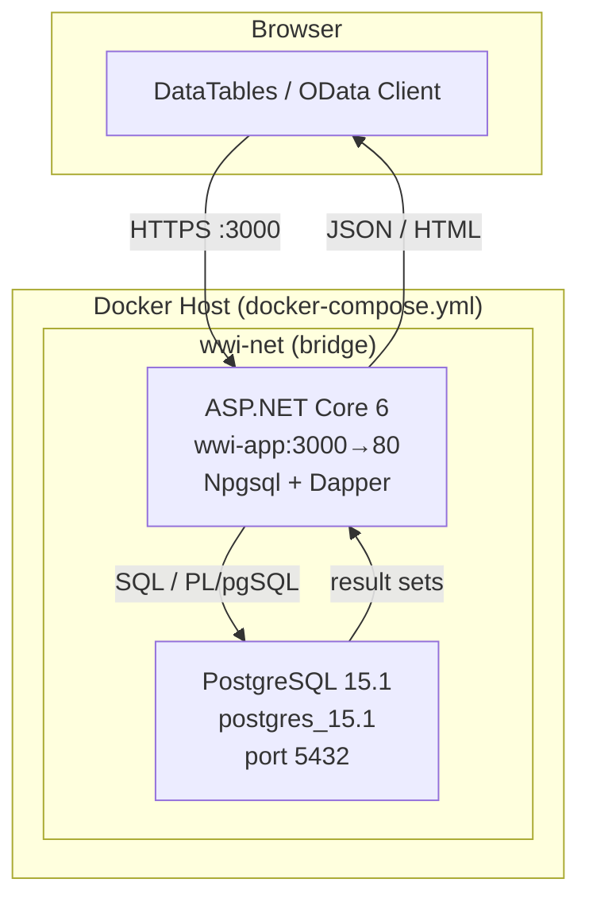
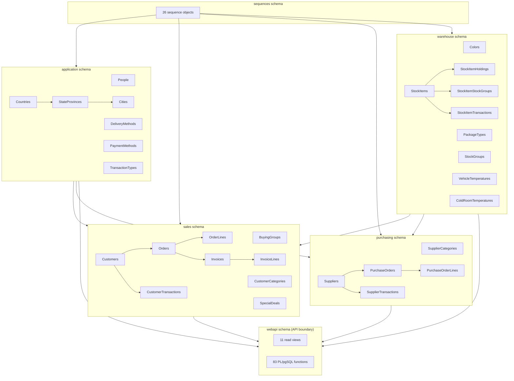
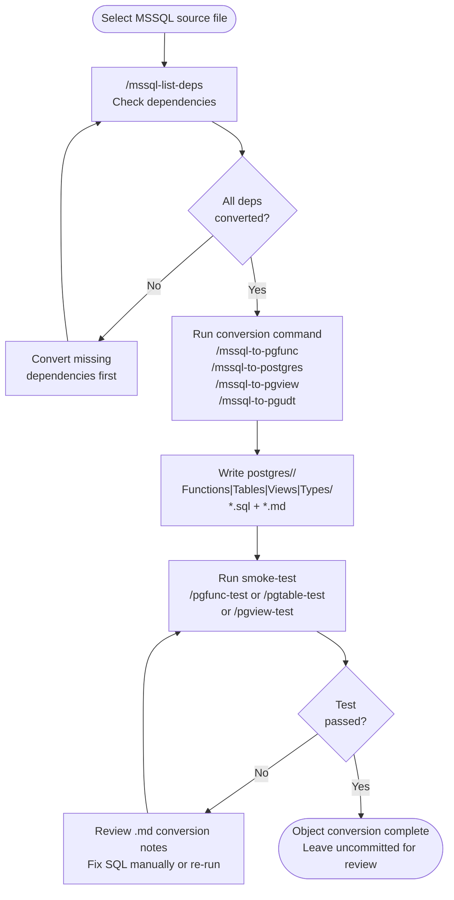
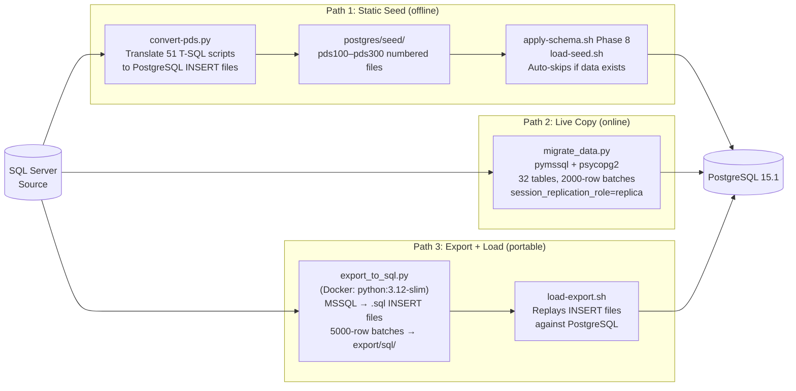

# Technical Architecture Document
## WideWorldImporters: MSSQL → PostgreSQL Migration

| Field | Value |
|---|---|
| **Project** | WideWorldImporters Database Migration |
| **Organization** | lowtouch.ai |
| **Version** | 1.0 |
| **Date** | May 2026 |
| **Status** | Completed |

---

> **lowtouch.ai** — *AI Agents That Run in Your Infrastructure. Deployed in Weeks, Not Months.*

---

## Table of Contents

1. [Document Purpose and Scope](#1-document-purpose-and-scope)
2. [Application Overview](#2-application-overview)
3. [Architecture Overview](#3-architecture-overview)
4. [Technology Stack](#4-technology-stack)
5. [Application Architecture](#5-application-architecture)
6. [Database Architecture](#6-database-architecture)
7. [Conversion Toolchain](#7-conversion-toolchain)
8. [Data Migration Pipeline](#8-data-migration-pipeline)
9. [Deployment Architecture](#9-deployment-architecture)
10. [Security Architecture](#10-security-architecture)
11. [Testing Architecture](#11-testing-architecture)
12. [Key Technical Decisions](#12-key-technical-decisions)
13. [Known Limitations and Deferred Work](#13-known-limitations-and-deferred-work)
14. [Glossary](#14-glossary)

---

## 1. Document Purpose and Scope

This document describes the technical architecture of the WideWorldImporters (WWI) MSSQL-to-PostgreSQL migration project. It covers the full runtime system — the ASP.NET Core web application, PostgreSQL database, Docker container topology — as well as the migration toolchain used to perform the conversion.

**The migration changed ONLY the database connectivity layer.** Application business logic, MVC structure, controller actions, views, and user-facing functionality are identical to the source system. The connectivity change was limited to replacing the database driver (Belgrade/SqlClient → Npgsql/Dapper).

**In scope:**

- The converted PostgreSQL schema and its 8 logical sub-schemas
- The ASP.NET Core 6 web application and its two controller patterns
- The Claude Code-based conversion toolchain (slash commands)
- The three-path data migration pipeline
- The Docker Compose deployment model
- The xUnit integration test suite

**Out of scope:**

- The source SQL Server environment (documented separately)
- The OLAP data warehouse (`wwi-dw-ssdt`)
- CI/CD pipeline configuration (not yet implemented)
- Authentication integration (managed separately as an infrastructure concern)

**Source system:** The [WideWorldImporters](https://github.com/Microsoft/sql-server-samples) OLTP sample database from Microsoft, used as a representative enterprise MSSQL workload for the purposes of demonstrating AI-assisted database migration.

---

## 2. Application Overview

### What is WideWorldImporters?

WideWorldImporters (WWI) is Microsoft's OLTP sample database representing a fictional wholesale novelty goods company. The accompanying web application is an ASP.NET Core 6 MVC-pattern app that exposes the database over two controller patterns:

- **TableController** — server-side paginated reads from PostgreSQL views, powering DataTables JS grids in the browser.
- **ODataController** — OData-style CRUD (GET/PUT/POST/DELETE) on 24 entity types, calling PL/pgSQL functions in the `webapi` schema.

### Source vs Target Environment

| Dimension | Source Environment | Target Environment |
|---|---|---|
| Database | SQL Server 2017 | PostgreSQL 15.1 |
| Web framework | ASP.NET Core 6 | ASP.NET Core 6 (unchanged) |
| Database driver | Belgrade + Microsoft.Data.SqlClient | Npgsql 8.0.3 + Dapper 2.1.28 |
| Container orchestration | None | Docker Compose with persistent mounted volumes |
| Runtime target | net6.0 | net6.0 (unchanged) |

### Scope of Change

**The migration changed ONLY the database connectivity layer. Application business logic, MVC structure, controller actions, views, and user-facing functionality are identical to the source system.** The only modification to application code was replacing the database driver registration in `Startup.cs` and updating connection string configuration. Belgrade and Microsoft.Data.SqlClient were replaced with Npgsql and Dapper; no controller, view, model, or business logic file was altered.

### Environment Setup

#### Prerequisites

- Docker Desktop (with WSL2 backend on Windows)
- WSL2 (Windows) or native Linux/macOS
- A `.env` file at the repository root containing database connection strings (not committed to the repository)

#### Source Stack Startup

```bash
docker compose -f docker-compose.mssql.yml up
```

Starts a SQL Server 2017 container. The application connects via Belgrade/SqlClient.

#### Target Stack Startup

```bash
docker compose up
```

Starts two services: the ASP.NET Core 6 application (`wwi-app`, port 3000:80) and the `postgres_15.1` PostgreSQL container (reached via the `agentomatic` external network). Connection strings are injected via environment variables from the `.env` file.

#### Persistent Storage

The PostgreSQL container mounts a named Docker volume for its data directory. Data survives `docker compose down` and `docker compose up` cycles. To perform a full reset and discard all data, use:

```bash
docker compose down -v
```

This destroys the named volume. The next `docker compose up` will start with an empty PostgreSQL instance requiring schema and data re-application.

---

## 3. Architecture Overview

The runtime system is a fully containerised two-tier application: a browser-based UI and an ASP.NET Core application server connected to a PostgreSQL database.



**Key architectural properties:**

- All runtime components run inside Docker, ensuring environment parity between development, test, and production deployments.
- The application server is the sole client of PostgreSQL; no other process connects to the database during normal operation.
- The `agentomatic` network is an external shared Docker network, allowing shared infrastructure services to be managed independently of the application stack.

---

## 4. Technology Stack

### Application Layer

| Component | Technology | Version | Purpose |
|---|---|---|---|
| Web framework | ASP.NET Core | 6.0 | HTTP request pipeline, MVC controllers, middleware |
| Target runtime | .NET | net6.0 | Application host |
| Database driver | Npgsql | 8.0.3 | PostgreSQL wire protocol, connection pooling |
| Micro-ORM | Dapper | 2.1.28 | SQL-to-object mapping, parameterised queries |
| Authentication | Microsoft.AspNetCore.Authentication.OpenIdConnect | 6.0.0 | Pre-existing authentication infrastructure (not a migration deliverable) |
| Serialisation | Newtonsoft.Json | 13.0.1 | JSON serialisation for OData and DataTables responses |

### Database Layer

| Component | Technology | Version | Purpose |
|---|---|---|---|
| RDBMS | PostgreSQL | 15.1 | Primary data store |
| Spatial extension | PostGIS | (bundled) | `geography` column type support |
| Crypto extension | pgcrypto | (bundled) | Password hashing and token generation |
| Procedural language | PL/pgSQL | (native) | Server-side functions replacing MSSQL stored procedures |

### Infrastructure Layer

| Component | Technology | Version | Purpose |
|---|---|---|---|
| Container runtime | Docker | — | Application and database containers |
| Orchestration | Docker Compose | — | Multi-container lifecycle management |
| App network | wwi-net (bridge) | — | Internal app↔db communication |
| Shared network | agentomatic (external) | — | Shared infrastructure network |

### Conversion Toolchain

| Component | Technology | Purpose |
|---|---|---|
| AI agent host | Claude Code | Interactive migration agent |
| Slash commands | Markdown command definitions in `.claude/commands/` | Codified conversion rules per object type |
| Smoke-test runner | Docker (`postgres_15.1`) + isolated `wwi_test` schema | Per-function validation without affecting live data |

### Data Migration Scripts

| Script | Runtime | Purpose |
|---|---|---|
| `scripts/convert-pds.py` | Python 3.x | Static T-SQL → PostgreSQL seed script translation |
| `scripts/migrate_data.py` | Python 3.x + pymssql + psycopg2 | Live dual-connection data copy |
| `scripts/export_to_sql.py` | Python 3.12-slim (Docker) | MSSQL → portable .sql INSERT file export |

### Testing Layer

| Component | Technology | Version | Purpose |
|---|---|---|---|
| Test framework | xUnit | — | Test runner and assertions |
| Mocking | Moq | — | Controller-layer unit test isolation |
| Integration host | Microsoft.AspNetCore.Mvc.Testing / WebApplicationFactory | — | In-process TestServer against real PostgreSQL |
| Test configuration | `appsettings.Testing.json` | — | Points TestServer at Docker Postgres |

---

## 5. Application Architecture

### Controller Pattern

The application exposes two distinct controller patterns, each serving a different access model:

#### `TableController` — Paginated Read-Only Views

Provides server-side paginated data for the DataTables JavaScript library. Each endpoint executes a SQL `SELECT` against a `webapi` schema view, returning a JSON payload with `recordsTotal`, `recordsFiltered`, and `data` arrays.

Endpoints (all GET, all paginated):

| Endpoint | Backing View |
|---|---|
| `/Table/SalesOrders` | `webapi.sales_orders` |
| `/Table/PurchaseOrders` | `webapi.purchase_orders` |
| `/Table/Invoices` | `webapi.invoices` |
| `/Table/CustomerTransactions` | `webapi.customer_transactions` |
| `/Table/SupplierTransactions` | `webapi.supplier_transactions` |
| `/Table/Customers` | `webapi.customers` |
| `/Table/Suppliers` | `webapi.suppliers` |
| `/Table/Countries` | `webapi.countries` |
| `/Table/Cities` | `webapi.cities` |
| `/Table/StateProvinces` | `webapi.state_provinces` |
| `/Table/StockItems` | `webapi.stock_items` |

#### `ODataController` — OData-style CRUD

Provides GET/PUT/POST/DELETE operations on 24 entity types. Each mutation operation passes the request body as a JSON string to a corresponding PL/pgSQL function in the `webapi` schema (e.g. `webapi.update_customer_from_json`, `webapi.insert_sales_order_from_json`, `webapi.delete_buying_group`).

Entities supported:

| Entity | GET | PUT | POST | DELETE |
|---|---|---|---|---|
| SalesOrders | Y | Y | Y | Y |
| SalesOrderLines | Y | Y | Y | Y |
| PurchaseOrders | Y | Y | Y | Y |
| PurchaseOrderLines | Y | Y | Y | Y |
| Invoices | Y | Y | Y | Y |
| InvoiceLines | Y | Y | Y | Y |
| CustomerTransactions | Y | Y | Y | Y |
| SupplierTransactions | Y | Y | Y | Y |
| Customers | Y | Y | Y | Y |
| Suppliers | Y | Y | Y | Y |
| BuyingGroups | Y | Y | Y | Y |
| Countries | Y | Y | Y | Y |
| Cities | Y | Y | Y | Y |
| StateProvinces | Y | Y | Y | Y |
| Colors | Y | Y | Y | Y |
| PackageTypes | Y | Y | Y | Y |
| StockGroups | Y | Y | Y | Y |
| StockItems | Y | Y | Y | Y |
| SupplierCategories | Y | Y | Y | Y |
| CustomerCategories | Y | Y | Y | Y |
| DeliveryMethods | Y | Y | Y | Y |
| PaymentMethods | Y | Y | Y | Y |
| TransactionTypes | Y | Y | Y | Y |
| SpecialDeals | Y | Y | Y | Y |

#### PascalCase Key Normalisation

PostgreSQL folds unquoted identifiers to lowercase. The DataTables client expects PascalCase JSON keys matching the original MSSQL column names. This is resolved at two levels:

1. **`ODataController.WithPascalCaseJsonKeys()`** — a regex-based post-processor that rewrites bare column references inside SQL `SELECT` clauses to use quoted PascalCase aliases: `(SELECT cola, colb FROM` → `(SELECT cola AS "ColA", colb AS "ColB" FROM`.
2. **`fix_jsonb_aliases.sql`** — applies quoted `"PascalCase"` aliases inside all `jsonb_to_record` / `jsonb_to_recordset` calls across 22 `webapi` functions, ensuring JSON decomposition targets the correct column names regardless of PostgreSQL case-folding.

### Authentication

**Note:** Authentication integration was not part of the migration scope. The connectivity change was limited to replacing the database driver (Belgrade/SqlClient → Npgsql/Dapper). Authentication configuration is managed separately as an infrastructure concern.

---

## 6. Database Architecture

### Schema Layout

| Schema | Tables | Views | Functions | Purpose |
|---|---|---|---|---|
| `application` | People, Countries, StateProvinces, Cities, DeliveryMethods, PaymentMethods, TransactionTypes, SystemParameters | — | Application-level utility functions | Reference and configuration data shared across all domains |
| `sales` | BuyingGroups, CustomerCategories, Customers, Orders, OrderLines, Invoices, InvoiceLines, CustomerTransactions, SpecialDeals | — | — | Sales domain entities |
| `purchasing` | SupplierCategories, Suppliers, PurchaseOrders, PurchaseOrderLines, SupplierTransactions | — | — | Purchasing domain entities |
| `warehouse` | Colors, PackageTypes, StockGroups, StockItems, StockItemHoldings, StockItemStockGroups, StockItemTransactions, VehicleTemperatures, ColdRoomTemperatures | — | — | Inventory and temperature monitoring |
| `webapi` | — | 11 read views | 83 PL/pgSQL CRUD functions | API boundary layer — the application's sole point of database access |
| `website` | — | customers, suppliers, vehicle_temperatures | Composite type functions | Website-specific views and UDT-dependent functions |
| `sequences` | — | — | — | 26 sequence objects (`foo_id_seq` naming convention) |

**PostGIS** (`geography` columns) and **pgcrypto** extensions are enabled at deployment time.

### The `webapi` Schema as API Boundary Layer

The `webapi` schema acts as the database's public API surface. The application never issues DML directly against base tables in `sales`, `purchasing`, `warehouse`, or `application`. All reads go through `webapi` views; all mutations go through `webapi` PL/pgSQL functions. This boundary enforces:

- A stable, versioned interface between the application layer and the storage layer
- Centralised business rule enforcement (validation, audit timestamps, FK resolution) inside PL/pgSQL
- The ability to refactor base table structure without modifying application code, as long as the `webapi` function signatures remain stable

The 83 functions in `webapi` follow a consistent naming convention:

| Prefix | Pattern | Example |
|---|---|---|
| `update_` | `update_<entity>_from_json(p_json text)` | `webapi.update_customer_from_json` |
| `insert_` | `insert_<entity>_from_json(p_json text)` | `webapi.insert_sales_order_from_json` |
| `delete_` | `delete_<entity>(p_id integer)` | `webapi.delete_buying_group` |
| `login` | `login(p_email text, p_password text)` | `webapi.login` |

### Schema Relationship Overview



---

## 7. Conversion Toolchain

### Overview

The migration used a set of custom Claude Code slash commands defined in `.claude/commands/`. Each command encodes a specific conversion rule set for a given MSSQL object type. The commands are designed to chain: dependency checking always precedes conversion, and smoke-testing always follows.

336 source objects were converted across 18 planned sessions.

### Slash Command Reference

| Command | Input | Output | Purpose |
|---|---|---|---|
| `/mssql-list-deps` | MSSQL source `.sql` or converted postgres `.sql` | Console report (read-only) | Pre-flight: lists FK/sequence/UDT dependencies with `✓ converted` / `✗ missing` status |
| `/mssql-to-postgres` | MSSQL DDL file or folder | `postgres/<Schema>/Tables/*.sql` + `.md` | Converts table DDL: sequences, temporal tables, geography, columnstore, extended properties |
| `/mssql-to-pgfunc` | MSSQL stored procedure `.sql` | `postgres/<Schema>/Functions/*.sql` + `.md` | Converts stored procedures to PL/pgSQL functions |
| `/mssql-to-pgview` | MSSQL view `.sql` | `postgres/<Schema>/Views/*.sql` + `.md` | Converts views, resolving schema references |
| `/mssql-to-pgudt` | MSSQL TABLE TYPE `.sql` | `postgres/<Schema>/Types/*.sql` + `.md` | Converts user-defined table types to PostgreSQL composite `CREATE TYPE` |
| `/mssql-to-api` | MSSQL stored procedure `.sql` | `api/routers/<schema>/`, `api/schemas/<schema>.py` | Generates FastAPI endpoint scaffolding (gates on table conversions existing) |
| `/pgfunc-test` | Converted function `.sql` | Console pass/fail | Smoke-tests function in isolated `wwi_test` schema inside `postgres_15.1` container |
| `/pgtable-test` | Converted table `.sql` | Console pass/fail | Smoke-tests table DDL in isolated schema |
| `/pgview-test` | Converted view `.sql` | Console pass/fail | Smoke-tests view in isolated schema |

### Per-Object Conversion Workflow



### MSSQL Feature Mapping

| MSSQL Feature | PostgreSQL Equivalent | Handling |
|---|---|---|
| `PERIOD FOR SYSTEM_TIME` temporal tables | Not supported natively | Strip temporal clause; `GENERATED ALWAYS AS ROW START/END` → plain `TIMESTAMP(6) NOT NULL DEFAULT CURRENT_TIMESTAMP` |
| `[Sequences].[FooID]` | `sequences.foo_id_seq` | Sequence object emitted before consuming table |
| `[sys].[geography]` | PostGIS `geography` | `CREATE EXTENSION IF NOT EXISTS postgis` at deployment |
| Columnstore indexes | No equivalent | Omitted with explanatory comment |
| `sp_addextendedproperty` table-level | `COMMENT ON TABLE` | Converted |
| `sp_addextendedproperty` column-level | `COMMENT ON COLUMN` | Converted |
| `sp_addextendedproperty` index-level | N/A | Omitted |

### 18-Session Execution Plan

| Sessions | Phase | Scope |
|---|---|---|
| 1–4 | Table DDL | sequences → reference tables → core tables → transaction tables (32 tables total) |
| 5 | UDTs + Functions | Website composite types; Application functions |
| 6 | Views | WebApi 23 views + Website 3 views |
| 7–10 | WebApi stored procedures | Delete (7), Insert (22), Update (22) functions |
| 11 | Website stored procedures | 8 stored procedures |
| 12 | Integration stored procedures | 13 stored procedures |
| 13 | Application + Sequences SPs | 15 + 2 stored procedures |
| 14–15 | DataLoadSimulation SPs | 6 stored procedures + 4 functions |
| 16–17 | PostDeployment seed scripts | 51 T-SQL seed files → `postgres/seed/` |
| 18 | Validation sweep | Full schema apply + smoke-test pass |

---

## 8. Data Migration Pipeline

Three distinct paths exist for getting data from the SQL Server source into PostgreSQL, depending on connectivity and operational requirements.



### Path 1: Static Seed (`convert-pds.py`)

Translates 51 T-SQL PostDeploymentScripts into PostgreSQL-compatible `INSERT` files. Key transformations:

| MSSQL Construct | PostgreSQL Output |
|---|---|
| `datetime2` / `smalldatetime` | `timestamp` |
| `nvarchar(n)` | `varchar(n)` or `text` |
| `bit` | `boolean` |
| `varbinary(max)` | `bytea` |
| `[Schema].[Table]` | `schema.table` (lowercase) |
| `[ColumnName]` bracket quoting | `"ColumnName"` double-quote quoting |
| Binary geography data | `NULL` |
| `DataLoadSimulation` helper calls | Inline subqueries |
| `GO` statements | Removed |
| `SET IDENTITY_INSERT ... ON/OFF` | Removed |
| `N'string'` prefix | `'string'` |
| `BEGIN TRAN` / `COMMIT TRAN` | Removed |

Output files are numbered `pds100`, `pds200`, `pds300` to enforce FK-dependency load order.

### Path 2: Live Dual-Connection Copy (`migrate_data.py`)

Connects to both SQL Server (`pymssql`) and PostgreSQL (`psycopg2`) simultaneously. Copies 32 tables in FK dependency order using 2000-row batches. Disables FK checking during load via `SET session_replication_role = replica`, re-enables after all tables complete. Handles geography and binary columns by substituting `NULL`. Uses `INSERT ... ON CONFLICT DO NOTHING` for idempotency. Two identity tables use `INSERT ... OVERRIDING SYSTEM VALUE` to preserve source IDs.

### Path 3: Export + Load (`export_to_sql.py` + `load-export.sh`)

Exports MSSQL data to self-contained `.sql` INSERT files (one file per table, 5000-row batches) into `export/sql/`. The exporter runs inside a Docker container (`python:3.12-slim` with `pymssql`) to avoid local driver installation requirements. The resulting files are portable and can be replayed against any PostgreSQL instance using `load-export.sh`.

### Large Dataset Strategy

All three migration paths apply a consistent set of techniques for handling large tables safely and resumably:

- **Chunked batch transfers** — all table transfers use fixed-size batches: 2,000 rows per batch in `migrate_data.py` and 5,000 rows per batch in `export_to_sql.py`. Each batch is committed independently, bounding memory usage and enabling partial-failure recovery.
- **FK constraint suppression** — `SET session_replication_role = replica` disables FK trigger checks for the duration of the migration session. FK enforcement is re-enabled after all tables have been loaded.
- **Idempotent inserts** — `INSERT ... ON CONFLICT DO NOTHING` makes every batch safe to re-run after a failure. Interrupting and restarting the migration will not produce duplicate key errors.
- **FK dependency ordering** — tables are migrated in FK dependency order (parent tables before child tables). Combined with `session_replication_role`, this avoids constraint violations even on the first load.
- **Geography/binary column handling** — geography and binary columns are converted to `NULL` rather than failing the batch on conversion errors.

> **Note on dataset scale:** The current migration scripts are validated for the WideWorldImporters sample dataset (~40K rows). For production datasets significantly larger (millions of rows), batch sizes and parallelism should be reviewed and tuned.

---

## 9. Deployment Architecture

### Docker Compose Topology

The `docker-compose.yml` defines two services connected to two networks:

| Service | Image | Port | Networks |
|---|---|---|---|
| `wwi-app` | Custom ASP.NET Core 6 image | 3000:80 | wwi-net, agentomatic |
| `postgres_15.1` | `postgres:15.1` | 5432 (internal) | wwi-net |

| Network | Type | Purpose |
|---|---|---|
| `wwi-net` | Bridge (internal) | App ↔ database communication |
| `agentomatic` | External (pre-existing) | Shared infrastructure network |

The `agentomatic` network is declared as `external: true`, meaning it must exist prior to `docker-compose up`. It is managed by a separate infrastructure compose file.

### Persistent Storage

The PostgreSQL container mounts a named Docker volume for its data directory (`/var/lib/postgresql/data`). This ensures that all schema objects, seed data, and application data persist across `docker compose down` / `docker compose up` cycles. The volume is managed by Docker and survives container recreation.

To perform a full environment reset (discard all data and start fresh), use:

```bash
docker compose down -v
```

This destroys the named volume. The next `docker compose up` will start with an empty PostgreSQL instance. Schema and data must be re-applied using `apply-schema.sh` and the appropriate data migration path.

### Schema Deployment: `apply-schema.sh`

The `scripts/apply-schema.sh` script performs idempotent schema setup in 9 ordered phases. Each phase uses `CREATE ... IF NOT EXISTS` semantics or equivalent guards to allow safe re-execution.

| Phase | Content | Object Count |
|---|---|---|
| 1 | Extensions | `postgis`, `pgcrypto` |
| 2 | Sequences | 26 `.sql` files in `postgres/Sequences/` |
| 3 | Tables | 32 tables in FK dependency order |
| 4 | Types | Website composite UDTs |
| 5 | Views | WebApi (23) + Website (3) views |
| 6 | Functions | Application + WebApi + Website + Integration — 83 total |
| 7 | Fixes | `fix_jsonb_aliases.sql`, `fix_insert_funcs.sql` |
| 8 | Seed data | 54 files via `load-seed.sh` — auto-skipped if data already present |
| 9 | Sequence sync | `fix_sequences.sql` — sets all sequences to `SELECT setval(..., MAX(id))` |

Phase 9 (sequence sync) is critical after any bulk data load. When rows are inserted with explicit ID values (e.g. during seeding), the sequence object's internal counter is not advanced. Without the sync, the next `INSERT` without an explicit ID will attempt to use an already-existing value and fail with a duplicate key error.

---

## 10. Security Architecture

**Note:** Authentication integration was not part of the migration scope. The connectivity change was limited to replacing the database driver (Belgrade/SqlClient → Npgsql/Dapper). Authentication configuration is managed separately as an infrastructure concern.

The security posture of the migrated system rests on the following database-level controls:

### Connection String Security

The application connects to PostgreSQL using a connection string injected at runtime via environment variables (`.env` file). No credentials are present in the repository. The `.env` file is excluded from version control via `.gitignore`.

### Database Access Boundary

The application connects to PostgreSQL using a single service account. Database-level authorisation is enforced by the `webapi` schema boundary — the service account requires `EXECUTE` on `webapi` functions and `SELECT` on `webapi` views. It does not require direct DML access to base tables in `sales`, `purchasing`, `warehouse`, or `application`. This schema-level separation limits the blast radius of any application-layer vulnerability.

### Referential Integrity

All FK constraints are active in normal operation. The `session_replication_role = replica` setting used during bulk data migrations is explicitly scoped to migration sessions only and is not applied during application runtime.

### Schema Isolation

Each logical domain (`sales`, `purchasing`, `warehouse`, `application`) is isolated in its own PostgreSQL schema. The `webapi` schema is the sole interface exposed to the application, providing a stable and auditable API surface.

---

## 11. Testing Architecture

### Test Pyramid

| Layer | Framework | Count | Scope |
|---|---|---|---|
| Unit | xUnit + Moq | 46 | Controller logic, claim parsing, JSON serialisation — no database |
| Integration | xUnit + WebApplicationFactory | 101 | Full HTTP stack against real `postgres_15.1` Docker container |
| **Total** | | **147** | All passing |

### Project Structure

```
wwi-app.Tests/
├── WwiWebAppFactory.cs          # Custom WebApplicationFactory — wires TestServer to Docker Postgres
├── DockerPostgresFixture.cs     # IAsyncLifetime fixture — connection health check before any test runs
├── appsettings.Testing.json     # Connection string pointing at Docker container
└── Tests/
    ├── TableControllerTests.cs  # 8 unit tests
    ├── ODataControllerTests.cs  # 11 unit tests
    ├── StockItemTests.cs
    ├── CustomerTests.cs
    ├── PurchasingTests.cs
    └── SalesTests.cs
```

### Test Execution Against Real PostgreSQL

All integration tests run against the real `postgres_15.1` Docker container — there are no database mocks. The `DockerPostgresFixture.cs` performs a connection health check before any test in the collection runs, retrying with exponential backoff until the container is responsive. If the container is unreachable after the timeout, all integration tests are marked as skipped rather than failed, preventing false negatives in environments without Docker.

### Integration Test Coverage

| Module | Tests | Scope |
|---|---|---|
| TableController | 8 unit tests | Pagination logic, JSON structure, DataTables response shape |
| ODataController | 11 unit tests | CRUD dispatch, JSON key normalisation, HTTP status codes |
| SalesOrders | 8 integration tests | GET/PUT/POST/DELETE against real PostgreSQL |
| Invoices | 8 integration tests | GET/PUT/POST/DELETE against real PostgreSQL |
| CustomerTransactions | 9 integration tests | Full filter permutation matrix |
| Purchasing module | Full filter permutations | PurchaseOrders, PurchaseOrderLines, SupplierTransactions |
| Warehouse module | Full filter permutations | StockItems, StockGroups, Colors, PackageTypes |

### `WwiWebAppFactory`

Extends `WebApplicationFactory<Program>`, overriding `ConfigureWebHost` to substitute `appsettings.Testing.json` as the active configuration. This replaces the production connection string with test values. The factory creates an in-process `TestServer` — requests traverse the full ASP.NET Core middleware pipeline (routing, authentication middleware, controller dispatch) before hitting real PostgreSQL.

### Filter Permutation Testing

The OData test suites (purchasing, sales, StockItems, Customers, SpecialDeals) generate the full permutation matrix of supported filter parameters and assert that:

1. The HTTP response is `200 OK`
2. The JSON response deserialises without error
3. The `recordsTotal` field is a non-negative integer

This validates that all filter combinations produce valid SQL without runtime errors in the PL/pgSQL functions.

---

## 12. Key Technical Decisions

| # | Decision | Rationale | Alternatives Considered | Outcome |
|---|---|---|---|---|
| ADR-01 | **Npgsql over Belgrade/SqlClient** | Belgrade is MSSQL-only and does not support PostgreSQL. Npgsql is the native PostgreSQL .NET driver with full async support and parameter type inference. Dapper provides lightweight SQL mapping without ORM overhead. | Entity Framework Core with Npgsql provider | Minimal code change — only connection string and driver registration changed in `Startup.cs`. Application logic, controllers, and views were untouched. |
| ADR-02 | **Npgsql + Dapper over Entity Framework Core** | The `webapi` schema boundary means the application calls named PL/pgSQL functions and queries views — there are no entity graphs to navigate or LINQ queries to compose. Dapper's thin SQL-to-object mapping is a precise fit. EF Core's added abstraction layer (migrations, change tracking, DbContext) would provide no benefit and would complicate the `webapi` function call pattern. | Entity Framework Core, raw ADO.NET | Npgsql 8.0.3 + Dapper 2.1.28 adopted. Connection pooling is handled by Npgsql natively. |
| ADR-03 | **Regex-based PascalCase quoting (`WithPascalCaseJsonKeys`) + `fix_jsonb_aliases.sql`** | PostgreSQL's identifier case-folding breaks DataTables JS which expects PascalCase JSON keys matching the original MSSQL column names. Two complementary fixes are applied: a controller-level regex rewrites dynamic SQL before execution; a one-time SQL migration adds quoted aliases inside all `jsonb_to_record`/`jsonb_to_recordset` calls across 22 functions. | (a) Rename all columns to lowercase and update all JS clients; (b) use `jsonb_object` with explicit key mapping in every function; (c) post-process JSON in C# middleware | Dual-layer approach adopted. Minimises changes to client code and keeps the fix close to the source (the SQL functions themselves). |
| ADR-04 | **Chunked batch migration + `session_replication_role = replica`** | Disabling FK trigger checks at the session level allows tables to be loaded in any order without violating constraints mid-batch. Fixed-size batches (2,000 rows in `migrate_data.py`, 5,000 rows in `export_to_sql.py`) bound memory usage and enable resumable transfer. `ON CONFLICT DO NOTHING` makes each batch idempotent. Re-enabling after all tables are loaded ensures constraints are enforced from that point forward. | (a) Load tables in strict FK dependency order without disabling checks; (b) use `DISABLE TRIGGER ALL` per table; (c) use `SET CONSTRAINTS ALL DEFERRED` | Combined approach adopted. Load order is still used as a belt-and-suspenders measure. |
| ADR-05 | **`DO $body$ ... END $body$` wrapper for procedural seed scripts** | Several PostDeploymentScripts contain conditional logic (IF EXISTS checks, variable declarations) that cannot be expressed as plain SQL statements. PostgreSQL requires anonymous PL/pgSQL blocks for procedural constructs at script level. Wrapping in `DO $body$` allows direct execution via `psql` without modification to the script runner. | (a) Rewrite all conditional logic as pure DML; (b) use a Python script executor that handles procedural constructs; (c) use stored procedures for seed logic | `DO $body$` wrapper adopted for all procedural seed files. Plain INSERT-only files run as bare SQL for performance. |

---

## 13. Known Limitations and Deferred Work

| Item | Description | Impact | Suggested Resolution |
|---|---|---|---|
| **Temporal table audit history** | MSSQL system-time temporal tables (`PERIOD FOR SYSTEM_TIME`, paired `_Archive` tables) have been converted to plain tables with `CREATED_AT`/`MODIFIED_AT` timestamp columns. The `_Archive` tables and their automatic history-capture behaviour are not present in the PostgreSQL schema. | Full row-history audit trail is unavailable. | Implement using PostgreSQL triggers writing to manually maintained `_archive` tables, or adopt the `temporal_tables` extension. |
| **Security schema GRANT scripts** | The 22 files in `wwi-ssdt/wwi-ssdt/Security/` define MSSQL role memberships, schema-level GRANT/DENY statements, and row-level security policies. These have not been converted. | PostgreSQL roles and RLS policies are not configured; the database relies on a single service account. | Convert GRANT statements using PostgreSQL `GRANT ... ON ALL TABLES/FUNCTIONS IN SCHEMA` syntax; implement RLS policies using `CREATE POLICY` if row-level isolation is required. |
| **Storage and filegroup scripts** | The 6 files in `wwi-ssdt/wwi-ssdt/Storage/` define MSSQL filegroups, partition schemes, and storage-aligned indexes. PostgreSQL does not have a filegroup concept. | No functional impact; PostgreSQL manages storage internally. | Omit filegroup definitions permanently. Evaluate PostgreSQL tablespaces if storage separation is required. Partition schemes may be reimplemented using PostgreSQL table partitioning if query performance requires it. |
| **Columnstore index stub functions** | MSSQL columnstore indexes (used in `Warehouse.StockItemTransactions` and `Warehouse.VehicleTemperatures`) have no PostgreSQL equivalent and were omitted with comments. | Analytical queries that relied on columnstore scan performance may be slower. | Evaluate PostgreSQL partial indexes, BRIN indexes, or columnar storage extensions (e.g. `cstore_fdw`, Hydra Columnar) for tables with large append-only workloads. |
| **DataLoadSimulation schema** | `DataLoadSimulation` stored procedures and functions generate synthetic OLTP workload. Conversion is partially complete; integration with the application's workload simulation runner (`workload-drivers/`) has not been validated end-to-end. | Synthetic load testing against PostgreSQL is not available. | Complete conversion of remaining `DataLoadSimulation` objects and validate the C# workload driver's connection strings and SP call signatures against the converted functions. |
| **CI/CD pipeline** | There is no automated build or deployment pipeline. Schema deployment and test execution require manual invocation of `apply-schema.sh` and `dotnet test`. | Deployment correctness depends on manual process discipline. | Add a GitHub Actions workflow: build Docker image, run `apply-schema.sh` against a test container, execute `dotnet test`, publish results. |
| **Large production datasets** | The current migration scripts are validated for the WideWorldImporters sample dataset (~40K rows). Batch sizes (2,000 rows in `migrate_data.py`, 5,000 rows in `export_to_sql.py`) and single-threaded execution are appropriate for sample-scale data. | For production datasets significantly larger (millions of rows), migration throughput may be insufficient and memory pressure may increase. | Tune batch sizes based on row width and available memory. Introduce parallel table-level workers for independent tables. Consider pgcopy-based bulk loading for the largest tables. |

---

## 14. Glossary

| Term | Definition |
|---|---|
| **ADR** | Architecture Decision Record — a short document capturing a significant technical decision, its context, and the alternatives considered. |
| **Agentomatic** | The name of the external Docker network shared between the application stack and shared infrastructure services. |
| **Belgrade** | Microsoft's deprecated query library for .NET that provided a thin wrapper over SqlClient for SQL Server. Replaced by Dapper + Npgsql in this migration. |
| **Chunked batch migration** | The practice of transferring data in fixed-size groups (e.g. 2,000 rows) with a commit after each group, enabling resumable and memory-safe transfer of large tables. |
| **Columnstore index** | A SQL Server index type that stores data column-by-column rather than row-by-row, optimised for analytical scan queries. Has no direct PostgreSQL equivalent. |
| **Composite type** | A PostgreSQL user-defined type composed of named fields, equivalent to a MSSQL TABLE TYPE when used as a function parameter. Created with `CREATE TYPE ... AS (...)`. |
| **Dapper** | A lightweight .NET micro-ORM that maps SQL query results to C# objects without a full ORM abstraction layer. |
| **DO block** | An anonymous PL/pgSQL code block in PostgreSQL, introduced by the `DO` keyword. Used to execute procedural logic (loops, conditionals) at script level without creating a named function. |
| **FK** | Foreign key — a referential integrity constraint linking a column in one table to the primary key of another. |
| **Geography** | A PostGIS data type for storing spatial data (points, lines, polygons) on a spherical earth model. Equivalent to MSSQL's `sys.geography`. |
| **Idempotent** | A property of an operation whereby applying it multiple times produces the same result as applying it once. `CREATE ... IF NOT EXISTS` makes DDL statements idempotent. |
| **Npgsql** | The open-source .NET data provider for PostgreSQL. Implements the ADO.NET interfaces and manages the PostgreSQL wire protocol connection. |
| **OData** | Open Data Protocol — a REST-based data access standard. In this project, the term is used loosely to describe the CRUD controller pattern, not strict OData protocol compliance. |
| **OIDC** | OpenID Connect — an identity layer on top of OAuth 2.0 that provides authentication and user identity claims. Used by the pre-existing authentication infrastructure; not a migration deliverable. |
| **PL/pgSQL** | PostgreSQL's procedural language for writing stored functions and procedures. Equivalent in role to MSSQL's T-SQL stored procedures. |
| **PostGIS** | A PostgreSQL extension that adds support for geographic objects (spatial data types, functions, and indexes). |
| **pgcrypto** | A PostgreSQL extension providing cryptographic functions including hashing (`crypt`, `gen_salt`) and encryption. |
| **Sequence** | A database object that generates a monotonically increasing series of integers, used for auto-increment primary keys. PostgreSQL `CREATE SEQUENCE` is equivalent to MSSQL `CREATE SEQUENCE`. |
| **session_replication_role** | A PostgreSQL session-level parameter that, when set to `replica`, suppresses trigger execution (including FK constraint triggers) for the duration of the session. Used during bulk data loads. |
| **Temporal table** | A SQL Server table type that automatically maintains a full history of row changes using a system-time period and a paired archive table. Not natively supported in PostgreSQL 15. |
| **UDT** | User-Defined Type — in MSSQL, a `CREATE TYPE ... AS TABLE` construct used to pass table-valued parameters to stored procedures. Converted to PostgreSQL composite types. |
| **webapi schema** | The PostgreSQL schema that acts as the application's sole database interface, exposing views for reads and PL/pgSQL functions for mutations. |
| **WebApplicationFactory** | An ASP.NET Core testing class that creates an in-process `TestServer` from the application's `Program` class, enabling full-stack integration tests without a running server process. |
| **WWI** | WideWorldImporters — the Microsoft SQL Server sample OLTP database used as the source for this migration project. |
| **wwi-net** | The Docker bridge network connecting the `wwi-app` application container and the `postgres_15.1` database container. |
